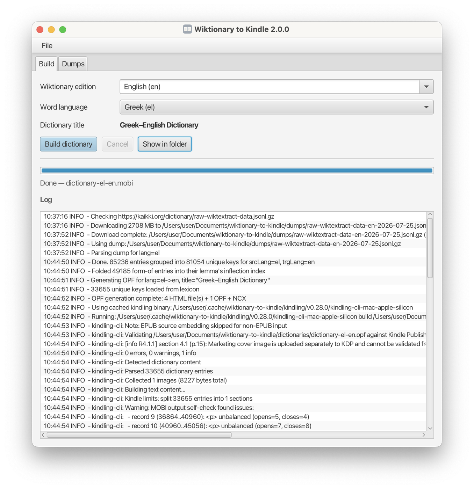

# wiktionary-to-kindle

Turns Wiktionary into a MOBI dictionary your Kindle can use for tap-to-define — in any of a hundred-odd languages, for any Wiktionary edition [kaikki.org](https://kaikki.org) publishes.

Available as a desktop app that bundles its own Java runtime, or as a command-line tool.



## Install

The desktop app is the recommended way to run this — it bundles its own Java runtime, so there is nothing else to install.

### macOS

```sh
brew install --cask nyg/tap/wiktionary-to-kindle
```

### Windows

```powershell
scoop bucket add nyg https://github.com/nyg/scoop-bucket
```

```powershell
scoop install wiktionary-to-kindle
```

Scoop installs per-user, needs no admin rights, and avoids the SmartScreen prompt.

### Linux

There is no Linux desktop package — Homebrew casks are macOS-only. Run the portable JAR instead, which needs Java 25 installed. See [Command line](#command-line).

### Manual download

Grab the [latest release](https://github.com/nyg/wiktionary-to-kindle/releases/latest):

| File | For |
|------|-----|
| `WiktionaryToKindle.dmg` | macOS (Apple Silicon) |
| `WiktionaryToKindle-Scoop.zip` | Windows — extract and run `Wiktionary to Kindle.exe` |
| `wiktionary-to-kindle-*.jar` | Linux, or scripted use anywhere. Needs Java 25 |

The app is ad-hoc signed but **not notarized**, so macOS quarantines the DMG download and blocks the first launch — you may see *"is damaged"* or *"Apple could not verify…"*, which both mean the same thing and do not mean the app is corrupted. Homebrew handles this for you. If you installed the DMG by hand, clear the flag once:

```sh
xattr -dr com.apple.quarantine "/Applications/Wiktionary to Kindle.app"
```

## Using the app

1. Pick a **Wiktionary edition** — which Wiktionary the definitions are written in. The Greek Wiktionary defines words in Greek.
2. Pick a **word language** — which language's words to include. Any language may appear in any edition.
3. Press **Build dictionary**.

So *edition: Greek, word language: English* gives you an English–Greek dictionary: look up an English word, read the definition in Greek. The title updates as you choose, so you can see what you are about to build.

The first build for an edition downloads its dump, which is 100 MB to several GB. Progress and a live log are shown throughout, and **Cancel** stops the run cleanly at any stage. Subsequent builds reuse the downloaded dump.

When it finishes, **Show in folder** reveals the `.mobi`. Copy it to your Kindle over USB, or send it to your device's Kindle email address.

The **Dumps** tab lists what has been downloaded, with the Wiktionary edition, generation date and size, and lets you delete dumps you no longer need — worth checking, since they are the largest thing this app puts on your disk.

### On your Kindle

Once the `.mobi` is on the device, set it as the default dictionary for its language, and tap-to-define uses it everywhere you read.


### Where files go

| What | Location |
|------|----------|
| Dumps and dictionaries | `~/Documents/wiktionary-to-kindle/` (change in Preferences) |
| Settings and logs | `~/.config/wiktionary-to-kindle/` — `%LOCALAPPDATA%\wiktionary-to-kindle\Config` on Windows |
| Cached `kindling-cli` | `~/.cache/wiktionary-to-kindle/` — `%LOCALAPPDATA%\wiktionary-to-kindle\Cache` on Windows |

Preferences also lets you point at a pre-installed `kindling-cli` or pin a specific version. Maximum heap is shown there but cannot be changed: it is fixed when the app starts, and the bundle sizes it at 75% of your machine's RAM.

## Command line

The same pipeline, for scripting and for Linux. Every release ships a portable JAR that runs anywhere with Java 25.

```sh
# Download a dump to ./dumps (skipped if one for that edition already exists)
java -jar wiktionary-to-kindle-<version>.jar download el

# Generate into ./dictionaries
# DUMP_LANG = which Wiktionary edition to read; WORD_LANG = ISO 639-1 filter
java -jar wiktionary-to-kindle-<version>.jar generate el en

# Pin a kindling release, or use one already installed
java -jar wiktionary-to-kindle-<version>.jar generate el en --kindling-version vX.Y.Z
java -jar wiktionary-to-kindle-<version>.jar generate el en --kindling-cli /usr/local/bin/kindling-cli

java -jar wiktionary-to-kindle-<version>.jar --help
java -jar wiktionary-to-kindle-<version>.jar --version
```

`dl` and `gen` are short aliases. The CLI resolves `dumps/` and `dictionaries/` relative to the working directory, and does not read the app's preferences. `download` exits non-zero if the transfer fails.

## How it works

1. A [kaikki.org](https://kaikki.org) pre-extracted Wiktionary JSONL dump is downloaded for the chosen edition. Dumps are produced weekly by [wiktextract](https://github.com/tatuylonen/wiktextract) and include all languages with Lua templates fully expanded.
2. The compressed JSONL is streamed and filtered by language. Each entry's senses are rendered into an HTML definition, its inflected forms are collected as Kindle lookup targets, and the result is grouped in memory by normalised key.
3. Chunked MobiPocket HTML files, a `toc.ncx` navigation map and an OPF manifest are written.
4. On first run, [kindling-cli](https://github.com/ciscoriordan/kindling) is downloaded and cached, verified against a pinned SHA-256.
5. `kindling-cli build` converts the OPF into a `.mobi` Kindle dictionary.

[`docs/program-flow.md`](docs/program-flow.md) has sequence diagrams for each stage.

## Inflected forms

Wiktionary entries on kaikki include a `forms` array listing every inflected form of the lemma — plurals, declension cases, conjugations, gender-agreement forms. `wiktionary-to-kindle` exposes those forms in two ways:

* **Lookup index** — every form becomes a tap-to-lookup target on Kindle via `<idx:iform>` markup. Looking up `συντρόφους` (the accusative plural) resolves to the lemma `σύντροφος`. Emitted for every part of speech, including verbs.
* **Visible paradigm table** — for non-verb entries, a small table of the form `{tag-abbrev}: {article} {form}` is appended to the definition. Verb entries skip the table (Greek, Romance and Slavic verbs have 50–200+ forms, which would dwarf the definition). A `forms.size() > 30` safety net also skips the table for pathological non-verb cases.

Gender-equivalent cross-references (e.g. `συντρόφισσα` listed as a feminine equivalent of `σύντροφος`, or `ingénieure` listed under `ingénieur`) are filtered out of the **lookup index** by a language-agnostic post-pass: any form whose normalised text already exists as a standalone headword in the same dump is dropped from the iform list, so long-press on `συντρόφισσα` resolves to its own entry instead of being shadowed by the lemma. The **visible "Forms:" table** in each entry's HTML body is untouched — readers still see the full paradigm (e.g. `ingénieure`, `ingénieurs`) under the lemma.

See [`docs/form-of-folding.md`](docs/form-of-folding.md) for the full design.

## Examples of generated dictionaries

* [English-English (96MB)](http://www.mediafire.com/file/uib98cjr19d0ddt/lexicon_en_en.mobi)
* [French-English (27MB)](http://www.mediafire.com/file/c3v5aijgp4q5ge3/lexicon_fr_en.mobi)
* [Greek-English (6MB)](http://www.mediafire.com/file/2nccw6ni32k4gmf/lexicon_gr_en.mobi)

## Building from source

Requires Java 25 and [Apache Maven](https://maven.apache.org).

```sh
mvn package        # runs tests, produces target/wiktionary-to-kindle-<version>.jar
mvn javafx:run     # runs the desktop app
```

To build a native bundle for the host platform:

```sh
scripts/package.sh          # defaults per platform; pass dmg, app-image, msi or deb explicitly
```

It jlinks a trimmed runtime, verifies it — TLS, locale data, the JavaFX modules and `ImageIO` all have to resolve inside the fresh image, and packaging fails if any of them do not — then runs `jpackage`. Output lands in `target/dist`.

Only the macOS `dmg` and Windows `app-image` targets are built in CI and shipped; the Linux `deb` target is a convenience for local use and is not exercised.

The shaded JAR deliberately excludes JavaFX so it stays cross-platform: JavaFX resolves to native, platform-specific artifacts, and the desktop app gets them from its bundled runtime instead.

## Releasing

Run the **Release** workflow from the Actions tab and choose a bump. It tags the release, builds the DMG, the Scoop ZIP and the portable JAR, publishes them, then updates [nyg/homebrew-tap](https://github.com/nyg/homebrew-tap) and [nyg/scoop-bucket](https://github.com/nyg/scoop-bucket).

## Helpful documentation

* [International Digital Publishing Forum](http://idpf.org)
* [EPUB 2 standard](http://idpf.org/epub/201)
* [EPUB 3 standard](https://www.w3.org/community/epub3/)
* [EPUB Dictionaries and Glossaries 1.0](http://idpf.org/epub/dict/)
* [EPUB – Wikipedia](https://en.wikipedia.org/wiki/EPUB)
* [Creating Dictionaries – Kindle Publishing Guidelines](https://kdp.amazon.com/en_US/help/topic/G2HXJS944GL88DNV)
