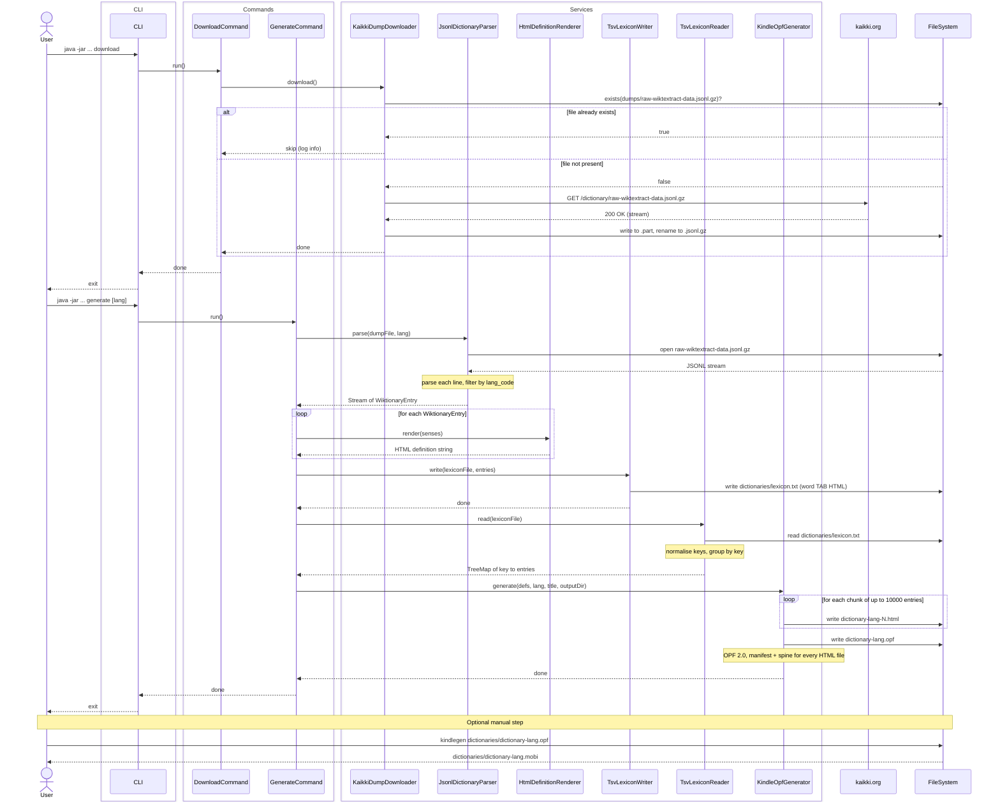

# Program Flow

```mermaid
sequenceDiagram
    actor User

    box CLI
        participant CLI
    end

    box Commands
        participant DownloadCommand
        participant GenerateCommand
    end

    box Services
        participant KaikkiDumpDownloader
        participant JsonlDictionaryParser
        participant HtmlDefinitionRenderer
        participant TsvLexiconWriter
        participant TsvLexiconReader
        participant KindleOpfGenerator
    end

    participant kaikki.org
    participant FileSystem

    %% ── download command ──────────────────────────────────────────────────────
    User->>CLI: java -jar ... download

    CLI->>DownloadCommand: run()
    DownloadCommand->>KaikkiDumpDownloader: download()
    KaikkiDumpDownloader->>FileSystem: exists(dumps/raw-wiktextract-data.jsonl.gz)?

    alt file already exists
        FileSystem-->>KaikkiDumpDownloader: true
        KaikkiDumpDownloader-->>DownloadCommand: skip (log info)
    else file not present
        FileSystem-->>KaikkiDumpDownloader: false
        KaikkiDumpDownloader->>kaikki.org: GET /dictionary/raw-wiktextract-data.jsonl.gz
        kaikki.org-->>KaikkiDumpDownloader: 200 OK (stream)
        KaikkiDumpDownloader->>FileSystem: write to .part, rename to .jsonl.gz
        KaikkiDumpDownloader-->>DownloadCommand: done
    end

    DownloadCommand-->>CLI: done
    CLI-->>User: exit

    %% ── generate command ──────────────────────────────────────────────────────
    User->>CLI: java -jar ... generate [lang]

    CLI->>GenerateCommand: run()

    GenerateCommand->>JsonlDictionaryParser: parse(dumpFile, lang)
    JsonlDictionaryParser->>FileSystem: open raw-wiktextract-data.jsonl.gz
    FileSystem-->>JsonlDictionaryParser: JSONL stream
    Note over JsonlDictionaryParser: parse each line, filter by lang_code
    JsonlDictionaryParser-->>GenerateCommand: Stream of WiktionaryEntry

    loop for each WiktionaryEntry
        GenerateCommand->>HtmlDefinitionRenderer: render(senses)
        HtmlDefinitionRenderer-->>GenerateCommand: HTML definition string
    end

    GenerateCommand->>TsvLexiconWriter: write(lexiconFile, entries)
    TsvLexiconWriter->>FileSystem: write dictionaries/lexicon.txt (word TAB HTML)
    TsvLexiconWriter-->>GenerateCommand: done

    GenerateCommand->>TsvLexiconReader: read(lexiconFile)
    TsvLexiconReader->>FileSystem: read dictionaries/lexicon.txt
    Note over TsvLexiconReader: normalise keys, group by key
    TsvLexiconReader-->>GenerateCommand: TreeMap of key to entries

    GenerateCommand->>KindleOpfGenerator: generate(defs, lang, title, outputDir)

    loop for each chunk of up to 10000 entries
        KindleOpfGenerator->>FileSystem: write dictionary-lang-N.html
    end

    KindleOpfGenerator->>FileSystem: write dictionary-lang.opf
    Note over KindleOpfGenerator: OPF 2.0, manifest + spine for every HTML file

    KindleOpfGenerator-->>GenerateCommand: done
    GenerateCommand-->>CLI: done
    CLI-->>User: exit

    %% ── kindlegen (manual step) ───────────────────────────────────────────────
    Note over User,FileSystem: Optional manual step
    User->>FileSystem: kindlegen dictionaries/dictionary-lang.opf
    FileSystem-->>User: dictionaries/dictionary-lang.mobi
```
