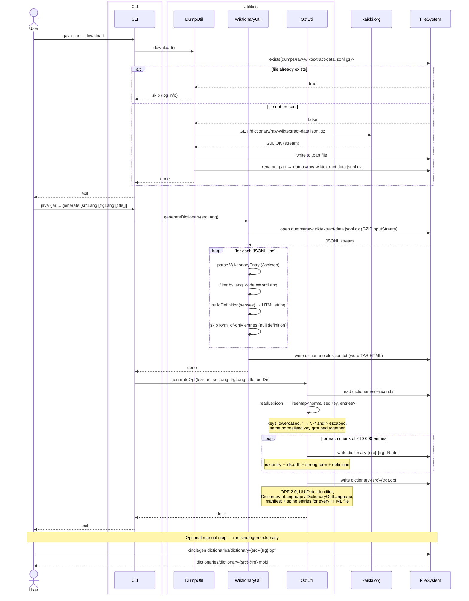

# Program Flow

```mermaid
sequenceDiagram
    actor User

    box CLI
        participant CLI
    end

    box Utilities
        participant DumpUtil
        participant WiktionaryUtil
        participant OpfUtil
    end

    participant kaikki.org
    participant FileSystem

    %% ── download command ──────────────────────────────────────────────────────
    User->>CLI: java -jar ... download

    CLI->>DumpUtil: download()
    DumpUtil->>FileSystem: exists(dumps/raw-wiktextract-data.jsonl.gz)?

    alt file already exists
        FileSystem-->>DumpUtil: true
        DumpUtil-->>CLI: skip (log info)
    else file not present
        FileSystem-->>DumpUtil: false
        DumpUtil->>kaikki.org: GET /dictionary/raw-wiktextract-data.jsonl.gz
        kaikki.org-->>DumpUtil: 200 OK (stream)
        DumpUtil->>FileSystem: write to .part file
        DumpUtil->>FileSystem: rename .part → dumps/raw-wiktextract-data.jsonl.gz
        DumpUtil-->>CLI: done
    end

    CLI-->>User: exit

    %% ── generate command ──────────────────────────────────────────────────────
    User->>CLI: java -jar ... generate [srcLang [trgLang [title]]]

    CLI->>WiktionaryUtil: generateDictionary(srcLang)
    WiktionaryUtil->>FileSystem: open dumps/raw-wiktextract-data.jsonl.gz (GZIPInputStream)
    FileSystem-->>WiktionaryUtil: JSONL stream

    loop for each JSONL line
        WiktionaryUtil->>WiktionaryUtil: parse WiktionaryEntry (Jackson)
        WiktionaryUtil->>WiktionaryUtil: filter by lang_code == srcLang
        WiktionaryUtil->>WiktionaryUtil: buildDefinition(senses) → HTML string
        WiktionaryUtil->>WiktionaryUtil: skip form_of-only entries (null definition)
    end

    WiktionaryUtil->>FileSystem: write dictionaries/lexicon.txt (word TAB HTML)
    WiktionaryUtil-->>CLI: done

    CLI->>OpfUtil: generateOpf(lexicon, srcLang, trgLang, title, outDir)
    OpfUtil->>FileSystem: read dictionaries/lexicon.txt
    OpfUtil->>OpfUtil: readLexicon → TreeMap<normalisedKey, entries>
    Note over OpfUtil: keys lowercased, " → ', < and > escaped,<br/>same normalised key grouped together

    loop for each chunk of ≤10 000 entries
        OpfUtil->>FileSystem: write dictionary-{src}-{trg}-N.html
        Note over OpfUtil: idx:entry + idx:orth + strong term + definition
    end

    OpfUtil->>FileSystem: write dictionary-{src}-{trg}.opf
    Note over OpfUtil: OPF 2.0, UUID dc:identifier,<br/>DictionaryInLanguage / DictionaryOutLanguage,<br/>manifest + spine entries for every HTML file

    OpfUtil-->>CLI: done
    CLI-->>User: exit

    %% ── kindlegen (manual step) ───────────────────────────────────────────────
    Note over User,FileSystem: Optional manual step — run kindlegen externally
    User->>FileSystem: kindlegen dictionaries/dictionary-{src}-{trg}.opf
    FileSystem-->>User: dictionaries/dictionary-{src}-{trg}.mobi
```
