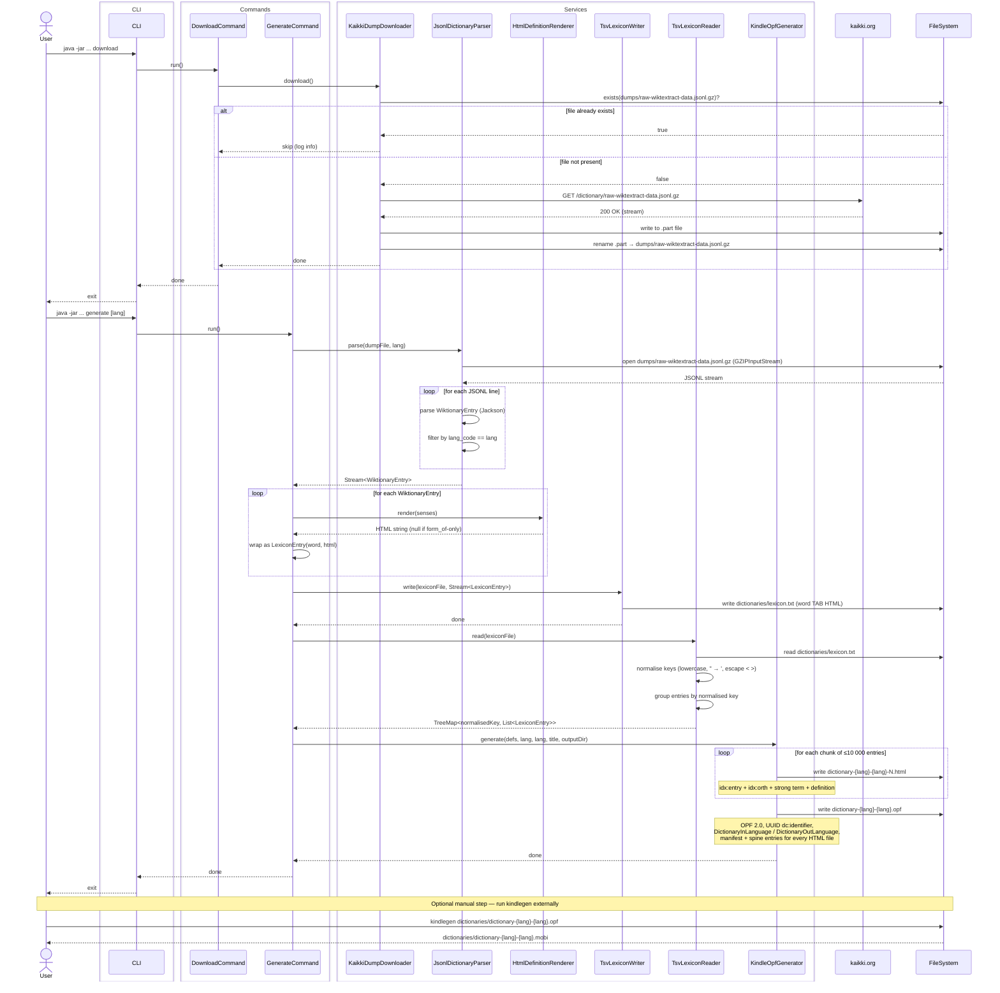

# Program Flow

```mermaid
sequenceDiagram
    actor User

    box CLI
        participant CLI
    end

    box Commands
        participant DownloadCommand
        participant GenerateCommand
    end

    box Services
        participant KaikkiDumpDownloader
        participant JsonlDictionaryParser
        participant HtmlDefinitionRenderer
        participant TsvLexiconWriter
        participant TsvLexiconReader
        participant KindleOpfGenerator
    end

    participant kaikki.org
    participant FileSystem

    %% ── download command ──────────────────────────────────────────────────────
    User->>CLI: java -jar ... download

    CLI->>DownloadCommand: run()
    DownloadCommand->>KaikkiDumpDownloader: download()
    KaikkiDumpDownloader->>FileSystem: exists(dumps/raw-wiktextract-data.jsonl.gz)?

    alt file already exists
        FileSystem-->>KaikkiDumpDownloader: true
        KaikkiDumpDownloader-->>DownloadCommand: skip (log info)
    else file not present
        FileSystem-->>KaikkiDumpDownloader: false
        KaikkiDumpDownloader->>kaikki.org: GET /dictionary/raw-wiktextract-data.jsonl.gz
        kaikki.org-->>KaikkiDumpDownloader: 200 OK (stream)
        KaikkiDumpDownloader->>FileSystem: write to .part file
        KaikkiDumpDownloader->>FileSystem: rename .part → dumps/raw-wiktextract-data.jsonl.gz
        KaikkiDumpDownloader-->>DownloadCommand: done
    end

    DownloadCommand-->>CLI: done
    CLI-->>User: exit

    %% ── generate command ──────────────────────────────────────────────────────
    User->>CLI: java -jar ... generate [lang]

    CLI->>GenerateCommand: run()

    GenerateCommand->>JsonlDictionaryParser: parse(dumpFile, lang)
    JsonlDictionaryParser->>FileSystem: open dumps/raw-wiktextract-data.jsonl.gz (GZIPInputStream)
    FileSystem-->>JsonlDictionaryParser: JSONL stream

    loop for each JSONL line
        JsonlDictionaryParser->>JsonlDictionaryParser: parse WiktionaryEntry (Jackson)
        JsonlDictionaryParser->>JsonlDictionaryParser: filter by lang_code == lang
    end

    JsonlDictionaryParser-->>GenerateCommand: Stream<WiktionaryEntry>

    loop for each WiktionaryEntry
        GenerateCommand->>HtmlDefinitionRenderer: render(senses)
        HtmlDefinitionRenderer-->>GenerateCommand: HTML string (null if form_of-only)
        GenerateCommand->>GenerateCommand: wrap as LexiconEntry(word, html)
    end

    GenerateCommand->>TsvLexiconWriter: write(lexiconFile, Stream<LexiconEntry>)
    TsvLexiconWriter->>FileSystem: write dictionaries/lexicon.txt (word TAB HTML)
    TsvLexiconWriter-->>GenerateCommand: done

    GenerateCommand->>TsvLexiconReader: read(lexiconFile)
    TsvLexiconReader->>FileSystem: read dictionaries/lexicon.txt
    TsvLexiconReader->>TsvLexiconReader: normalise keys (lowercase, " → ', escape < >)
    TsvLexiconReader->>TsvLexiconReader: group entries by normalised key
    TsvLexiconReader-->>GenerateCommand: TreeMap<normalisedKey, List<LexiconEntry>>

    GenerateCommand->>KindleOpfGenerator: generate(defs, lang, lang, title, outputDir)

    loop for each chunk of ≤10 000 entries
        KindleOpfGenerator->>FileSystem: write dictionary-{lang}-{lang}-N.html
        Note over KindleOpfGenerator: idx:entry + idx:orth + strong term + definition
    end

    KindleOpfGenerator->>FileSystem: write dictionary-{lang}-{lang}.opf
    Note over KindleOpfGenerator: OPF 2.0, UUID dc:identifier,<br/>DictionaryInLanguage / DictionaryOutLanguage,<br/>manifest + spine entries for every HTML file

    KindleOpfGenerator-->>GenerateCommand: done
    GenerateCommand-->>CLI: done
    CLI-->>User: exit

    %% ── kindlegen (manual step) ───────────────────────────────────────────────
    Note over User,FileSystem: Optional manual step — run kindlegen externally
    User->>FileSystem: kindlegen dictionaries/dictionary-{lang}-{lang}.opf
    FileSystem-->>User: dictionaries/dictionary-{lang}-{lang}.mobi
```
