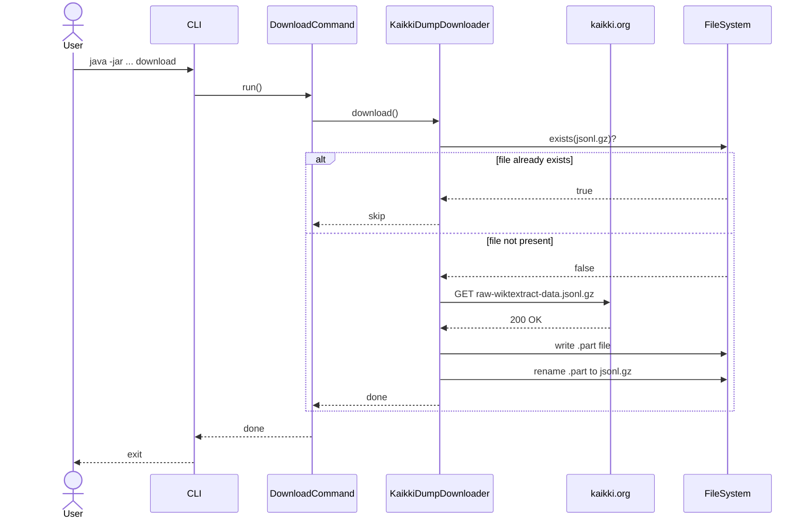
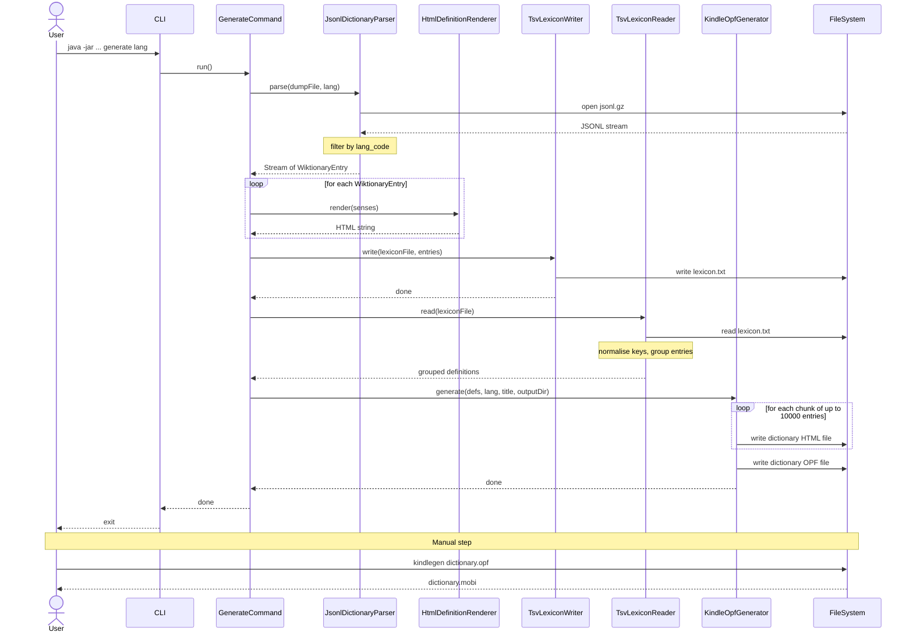

# Program Flow

## Download command

```mermaid
sequenceDiagram
    actor User
    participant CLI
    participant DownloadCommand
    participant KaikkiDumpDownloader
    participant kaikkiorg as kaikki.org
    participant FileSystem

    User->>CLI: java -jar ... download
    CLI->>DownloadCommand: run()
    DownloadCommand->>KaikkiDumpDownloader: download()
    KaikkiDumpDownloader->>FileSystem: exists(jsonl.gz)?

    alt file already exists
        FileSystem-->>KaikkiDumpDownloader: true
        KaikkiDumpDownloader-->>DownloadCommand: skip
    else file not present
        FileSystem-->>KaikkiDumpDownloader: false
        KaikkiDumpDownloader->>kaikkiorg: GET raw-wiktextract-data.jsonl.gz
        kaikkiorg-->>KaikkiDumpDownloader: 200 OK
        KaikkiDumpDownloader->>FileSystem: write .part file
        KaikkiDumpDownloader->>FileSystem: rename .part to jsonl.gz
        KaikkiDumpDownloader-->>DownloadCommand: done
    end

    DownloadCommand-->>CLI: done
    CLI-->>User: exit
```

## Generate command

```mermaid
sequenceDiagram
    actor User
    participant CLI
    participant GenerateCommand
    participant JsonlDictionaryParser
    participant HtmlDefinitionRenderer
    participant TsvLexiconWriter
    participant TsvLexiconReader
    participant KindleOpfGenerator
    participant FileSystem

    User->>CLI: java -jar ... generate lang
    CLI->>GenerateCommand: run()

    GenerateCommand->>JsonlDictionaryParser: parse(dumpFile, lang)
    JsonlDictionaryParser->>FileSystem: open jsonl.gz
    FileSystem-->>JsonlDictionaryParser: JSONL stream
    Note over JsonlDictionaryParser: filter by lang_code
    JsonlDictionaryParser-->>GenerateCommand: Stream of WiktionaryEntry

    loop for each WiktionaryEntry
        GenerateCommand->>HtmlDefinitionRenderer: render(senses)
        HtmlDefinitionRenderer-->>GenerateCommand: HTML string
    end

    GenerateCommand->>TsvLexiconWriter: write(lexiconFile, entries)
    TsvLexiconWriter->>FileSystem: write lexicon.txt
    TsvLexiconWriter-->>GenerateCommand: done

    GenerateCommand->>TsvLexiconReader: read(lexiconFile)
    TsvLexiconReader->>FileSystem: read lexicon.txt
    Note over TsvLexiconReader: normalise keys, group entries
    TsvLexiconReader-->>GenerateCommand: grouped definitions

    GenerateCommand->>KindleOpfGenerator: generate(defs, lang, title, outputDir)

    loop for each chunk of up to 10000 entries
        KindleOpfGenerator->>FileSystem: write dictionary HTML file
    end

    KindleOpfGenerator->>FileSystem: write dictionary OPF file
    KindleOpfGenerator-->>GenerateCommand: done
    GenerateCommand-->>CLI: done
    CLI-->>User: exit

    Note over User,FileSystem: Manual step
    User->>FileSystem: kindlegen dictionary.opf
    FileSystem-->>User: dictionary.mobi
```
