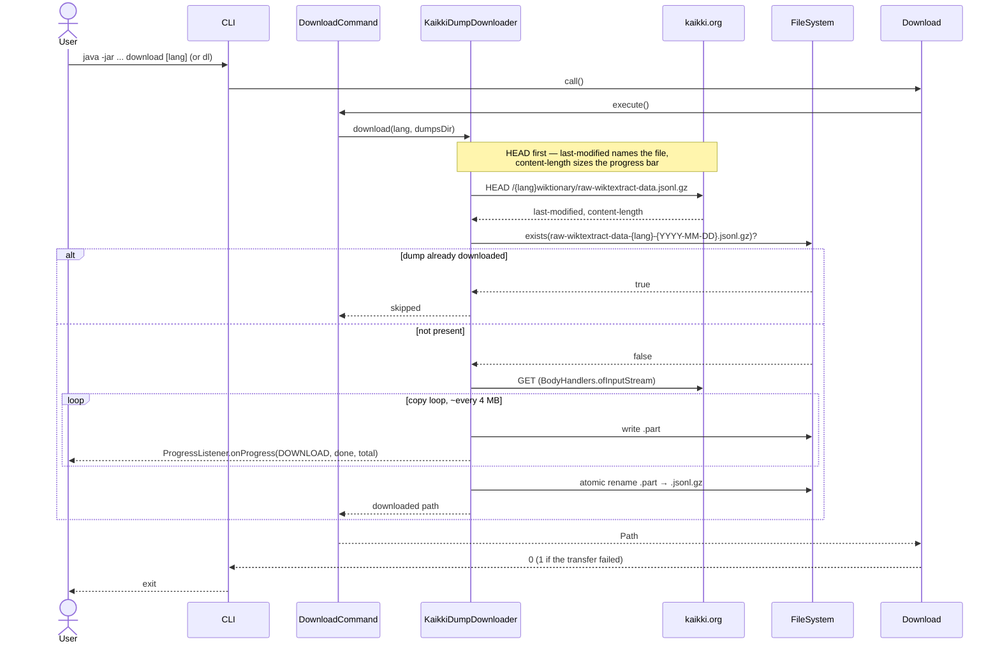

# Program Flow

Both front-ends drive the same service layer. The GUI runs download and generate back to back as one
`DictionaryPipeline`; the CLI exposes them as two separate subcommands.

## Download



## Generate

```mermaid
sequenceDiagram
    actor User
    participant CLI
    participant GenerateCommand
    participant JsonlDictionaryParser
    participant HtmlDefinitionRenderer
    participant KindlingDictionaryConverter as KindlingDictionaryConverter
    participant OpfDictionaryWriter
    participant KindlingCliResolver
    participant kindling as kindling-cli
    participant FileSystem

    User->>CLI: java -jar ... generate DUMP_LANG WORD_LANG (or gen)
    CLI->>CLI: findLatestDump(DUMP_LANG) → DumpCatalog.latestFor
    CLI->>Generate: call()
    Generate->>GenerateCommand: execute()

    GenerateCommand->>JsonlDictionaryParser: parse(dumpFile, wordLang)
    JsonlDictionaryParser->>FileSystem: open raw-wiktextract-data-{lang}-{date}.jsonl.gz
    FileSystem-->>JsonlDictionaryParser: gzipped JSONL stream
    Note over JsonlDictionaryParser: lazy Stream, filtered by lang_code;<br/>progress counts the compressed bytes
    JsonlDictionaryParser-->>GenerateCommand: Stream<WiktionaryEntry>

    loop for each WiktionaryEntry
        GenerateCommand->>HtmlDefinitionRenderer: render(senses)
        HtmlDefinitionRenderer-->>GenerateCommand: Optional<RenderedEntry>
        Note over GenerateCommand: skip empty; normalise key,<br/>group into TreeMap
    end

    Note over GenerateCommand: post-passes:<br/>1. foldFormOfEntries()<br/>2. filterFormsCollidingWithHeadwords()

    GenerateCommand->>KindlingDictionaryConverter: write(grouped, srcLang, trgLang, title, outputDir)
    KindlingDictionaryConverter->>OpfDictionaryWriter: write(..., outputDir/intermediate/{base name})

    loop for each chunk of up to 10 000 entries
        OpfDictionaryWriter->>FileSystem: write dictionary-{src}-{trg}-N.html
    end
    OpfDictionaryWriter->>FileSystem: write toc.ncx
    OpfDictionaryWriter->>FileSystem: write dictionary-{src}-{trg}.opf
    OpfDictionaryWriter-->>KindlingDictionaryConverter: OPF path

    KindlingDictionaryConverter->>KindlingCliResolver: resolve()
    Note over KindlingCliResolver: --kindling-cli override → PATH probe →<br/>cache (SHA-256 verified) → download
    KindlingCliResolver-->>KindlingDictionaryConverter: binary path

    KindlingDictionaryConverter->>kindling: build {opf} -o {mobi}
    Note over KindlingDictionaryConverter,kindling: merged stdout/stderr pumped through SLF4J
    kindling->>FileSystem: write dictionary-{src}-{trg}.mobi
    kindling-->>KindlingDictionaryConverter: exit 0

    opt preferences.deleteIntermediateFiles
        KindlingDictionaryConverter->>FileSystem: delete outputDir/intermediate/{base name}
    end

    KindlingDictionaryConverter-->>GenerateCommand: MOBI path
    GenerateCommand-->>Generate: Path
    Generate-->>CLI: 0
    CLI-->>User: dictionaries/dictionary-{src}-{trg}.mobi
```

## GUI pipeline

The desktop app runs the two stages as one background task, so a first build downloads and generates
without further input.

```mermaid
sequenceDiagram
    actor User
    participant MainController
    participant PipelineService
    participant PipelineTask
    participant DictionaryPipeline
    participant KaikkiDumpDownloader
    participant GenerateCommand

    User->>MainController: Build dictionary
    MainController->>PipelineService: reset(), start()
    PipelineService->>PipelineTask: call() on a worker thread
    PipelineTask->>DictionaryPipeline: run(prefs, editionLang, wordLang, progress, onKindlingStart)

    Note over DictionaryPipeline,GenerateCommand: the pipeline composes the collaborators itself —<br/>it does not go through the CLI's DownloadCommand
    DictionaryPipeline->>KaikkiDumpDownloader: download()
    KaikkiDumpDownloader-->>DictionaryPipeline: DownloadResult (alreadyPresent → reused)
    DictionaryPipeline->>GenerateCommand: execute()
    GenerateCommand-->>DictionaryPipeline: MOBI path

    loop throughout
        DictionaryPipeline-->>MainController: ProgressListener.onProgress (worker thread)
        MainController->>MainController: Platform.runLater(ProgressSnapshot)
    end

    DictionaryPipeline-->>PipelineTask: MOBI path
    PipelineTask-->>MainController: onSucceeded → enable Show in folder, refresh Dumps

    Note over User,PipelineTask: Cancel interrupts the worker for the download and<br/>parse loops; the kindling stage blocks in Process.waitFor(),<br/>so PipelineTask destroys the tracked process in cancelled()
```
